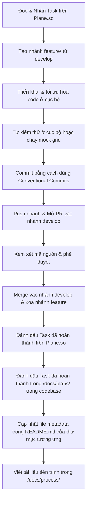

# Hướng dẫn Phát triển (Development Guidelines)

Tài liệu này đóng vai trò là cẩm nang phát triển và tài liệu onboarding kỹ thuật cho dự án **Vietnamese LLM KV Cache Benchmarking**. Nó chi tiết hóa việc thiết lập môi trường, chiến lược phân nhánh Git, các quy ước lập trình, quy trình kiểm thử và các tiêu chuẩn đảm bảo chất lượng.

---

## 1. Công nghệ & Kiến trúc dự án (Project Stack & Architecture)

Chúng tôi tập trung vào đánh giá các kỹ thuật nén KV Cache trên các mô hình ngôn ngữ lớn (LLM) tiếng Việt sử dụng cấu trúc công nghệ sau:
*   **Core (Lõi)**: Python 3.10, PyTorch, vLLM, llama.cpp, HQQ.
*   **Xử lý dữ liệu (Data Processing)**: NVIDIA NeMo Curator, Hugging Face `datasets` & `transformers`.
*   **Hạ tầng (Infrastructure)**: RunPod / Vast.ai Cloud GPU. Cụ thể nhóm sử dụng các máy chủ thuê cấu hình **RTX 3090/4090 (24GB VRAM)** để chạy thử nghiệm (smoke/preflight) và máy chủ cao cấp **A100 80GB VRAM** để thực hiện đợt chạy Grid Search chính thức và đo Perplexity offline.
*   **Giám sát & Phân tích (Monitoring & Analysis)**: `pynvml` (giám sát chỉ số GPU qua background sampler `VRAMMonitor`), `pandas` (tổng hợp dữ liệu thống kê), `matplotlib`/`plotly` (trực quan hóa kết quả).

Đối với các thành phần chi tiết của hệ thống, vui lòng tham khảo [Tài liệu Kiến trúc Hệ thống](docs/sys-arch.md).

---

## 2. Khởi động nhanh (Getting Started)

### 2.1 Điều kiện tiên quyết (Prerequisites)
*   Một phiên bản Python đang hoạt động tốt (khuyến nghị Python 3.10).
*   Đối với các lượt chạy trên GPU, cần môi trường tương thích CUDA 12.x.
*   Cài đặt Docker (phục vụ cho container chạy pipeline xử lý dữ liệu).

### 2.2 Thiết lập môi trường cục bộ (Local Environment Setup)
Để khởi tạo môi trường làm việc cục bộ của bạn:
```bash
# Clone kho lưu trữ
git clone https://github.com/darktheDE/viet-llm-kvcache-benchmark.git
cd viet-llm-kvcache-benchmark

# Tạo môi trường Conda mới với tên viet-llm
conda create -n viet-llm python=3.10 -y
conda activate viet-llm

# Cài đặt các thư viện phụ thuộc của dự án
pip install -r requirements.txt
```

### 2.3 Quy trình chạy trên Docker Local (Data Pipeline & Validation)
Nhóm sử dụng Docker Local để chuẩn bị dữ liệu tiếng Việt thời sự, làm sạch và đóng gói testset mà không bắt buộc có GPU:
```bash
# 1. Build Docker image
docker compose build

# 2. Khởi chạy shell tương tác bên trong container data-pipeline
docker compose run --rm data-pipeline bash

# 3. Chạy toàn bộ pipeline chuẩn bị dữ liệu (Bên trong container)
python scripts/download_datasets.py --max-records-per-source 5000
python scripts/clean_with_nemo.py --input-dir data/raw --output data/processed/cleaned.jsonl --backend auto
python scripts/build_long_context_testset.py --input data/processed/cleaned.jsonl --output datasets/test_set_small.json
python scripts/validate_testset.py --input datasets/test_set_small.json --schema long_context
python scripts/validate_testset.py --input datasets/test_set_tasks_small.json --schema task
```

### 2.4 Quy trình chạy thực tế trên Server thuê (RunPod / Vast.ai)
Đối với việc thực thi grid search lớn và nén KV cache, nhóm thuê máy chủ **A100 80GB** (hoặc RTX 3090/4090 làm smoke test) trên RunPod/Vast.ai:
```bash
# Kích hoạt môi trường conda
conda activate viet-llm

# 1. Chạy Grid Search cho các model tiêu chuẩn (Qwen3, Qwen2.5, Mistral, Llama 3.1)
python scripts/test/run_real_grid.py --hf_token "your_hf_token"

# 2. Chạy Grid Search cho các model phụ/thử nghiệm (Phi-4, Gemma-3)
python scripts/test/run_real_grid_extra.py --hf_token "your_hf_token"

# 3. Chạy tối ưu hóa riêng cho Mistral 7B (Load model 1 lần duy nhất cho mỗi phương pháp nén)
python scripts/test/run_mistral_optimized.py --hf_token "your_hf_token"

# 4. Tính toán Perplexity offline và điền (backfill) kết quả
python scripts/compute_all_ppl.py \
  --input_csv results/template_log_real_run.csv \
  --output_csv results/template_log_real_run_all.csv \
  --hf_token "your_hf_token"

# 5. Vẽ biểu đồ Pareto và tổng hợp kết quả cuối cùng
python scripts/plot_results.py
```

---

## 3. Quy trình Phát triển & Git-Flow (Development Workflow & Git-Flow)

Mọi đóng góp mã nguồn của các thành viên phải tuân thủ quy trình Git chi tiết dưới đây:

### 3.1 Chiến lược phân nhánh (Branching Strategy)
*   **Nhánh nguồn**: Tất cả các nhánh tính năng đều phải được phân nhánh từ nhánh phát triển chung `develop`.
*   **Quy ước đặt tên nhánh**: Đặt tiền tố cho các nhánh tính năng là `feature/` theo sau là tên mô tả ngắn gọn:
    ```bash
    git checkout develop
    git pull origin develop
    git checkout -b feature/ten-tinh-nang-cua-ban
    ```
    *(Ví dụ: `feature/run-baseline-setup`, `feature/pareto-plotting`)*

### 3.2 Chu kỳ Tính năng (Feature Lifecycle)


> [!IMPORTANT]
> **Quy trình hoàn thành Task bắt buộc:**
> Khi kết thúc một task, ngoài việc đánh dấu hoàn thành trên **Plane.so**, người thực hiện task bắt buộc phải thực hiện thêm các bước sau trực tiếp trong codebase:
> 1. **Đánh dấu hoàn thành trong `/docs/plans/`**: Cập nhật trạng thái task từ chưa hoàn thành `[ ]` thành đã hoàn thành `[x]` trong các file kế hoạch sprint tương ứng (ví dụ: `sprint01.md`, `sprint02.md`,...) nằm trong thư mục [docs/plans/](docs/plans).
> 2. **Cập nhật file metadata trong `README.md` của thư mục**: Nếu task có tạo mới hoặc sửa đổi các file trong dự án, bắt buộc phải cập nhật/bổ sung thông tin chi tiết của các file đó (Tên file, Người tạo - Tên và Email, Vai trò/Mục đích) vào bảng file metadata trong file `README.md` của thư mục chứa file đó.
> 3. **Viết tài liệu tiến trình trong `/docs/process/`**: Tạo một file tài liệu tiến trình (Process Document) chi tiết ghi lại quy trình thực hiện task, các cấu hình đã chạy và kết quả đạt được. Tài liệu này bắt buộc phải được viết **BẰNG TIẾNG VIỆT** và lưu vào thư mục [docs/process/](docs/process).

### 3.3 Hướng dẫn Thông điệp Commit (Conventional Commits)
Mỗi thông điệp commit phải thể hiện rõ ràng mục đích của thay đổi:
*   `feat: <mô tả>` - Thêm tính năng mới.
*   `fix: <mô tả>` - Sửa một lỗi kỹ thuật.
*   `docs: <mô tả>` - Thay đổi hoặc bổ sung tài liệu hướng dẫn.
*   `refactor: <mô tả>` - Tái cấu trúc mã nguồn nhưng không làm thay đổi hành vi/tính năng.
*   `chore: <mô tả>` - Cập nhật thư viện phụ thuộc, file cấu hình, v.v.

---

## 4. Phong cách lập trình & Quy ước viết mã (PEP 8)

### 4.1 Tiêu chuẩn Python
*   **Định dạng**: Sử dụng chính xác **4 khoảng trắng (spaces)** để thụt lề. **Tuyệt đối không dùng tab**.
*   **Biến & Hàm**: Sử dụng dạng `snake_case` (ví dụ: `peak_memory_mb`, `get_gpu_metrics`).
*   **Class**: Sử dụng dạng `PascalCase` (ví dụ: `MetricTracer`, `DatasetValidator`).
*   **Hằng số**: Sử dụng dạng chữ in hoa `UPPER_CASE` (ví dụ: `DEFAULT_CONTEXT_LENGTH`, `MAX_TOKENS`).

### 4.2 Docstrings & Tài liệu hướng dẫn mã nguồn
Mỗi class và hàm chính bắt buộc phải bao gồm một docstring mô tả chi tiết định nghĩa các tham số đầu vào (`Args`) và giá trị trả về (`Returns`):
```python
def log_metric(model_name: str, metric_value: float) -> bool:
    """Ghi nhận chỉ số đo đạc hiệu năng vào file CSV mẫu.

    Args:
        model_name (str): Tên hoặc ID của mô hình LLM được đánh giá.
        metric_value (float): Giá trị thực tế đo được của chỉ số.

    Returns:
        bool: Trả về True nếu ghi log thành công, ngược lại trả về False.
    """
    # phần triển khai code tại đây
    return True
```

### 4.3 Tính liêm chính trong học thuật (Academic Integrity)
> [!CRITICAL]
> **Giữ nguyên tất cả các bình luận học thuật và phương trình toán học** giải thích các thuật toán nén KV Cache (ví dụ: biến đổi Polar, tối ưu hóa Lloyd-Max, công thức QJL) trong mã nguồn. Không xóa hoặc đơn giản hóa ngữ cảnh lý thuyết.

### 4.4 Các nguyên tắc phần mềm (Software Principles)
*   **KISS (Keep It Simple, Stupid)**: Viết mã nguồn đơn giản, dễ hiểu và tường minh. Tránh tạo các lớp trừu tượng không cần thiết để đo lường các chỉ số.
*   **DRY (Don't Repeat Yourself)**: Tránh lặp lại code. Gom các đoạn mã tính toán chỉ số (ví dụ: peak VRAM measurement hooks, TTFT triggers) vào các module dùng chung trong thư mục [scripts/](scripts).

---

## 5. Kiểm thử & Đảm bảo Chất lượng (Testing & QA)

Trước khi gửi Pull Request (PR), hãy đảm bảo thay đổi của bạn đã được kiểm chứng thông qua một trong các quy trình kiểm thử sau:

### 5.1 Kiểm thử chạy cục bộ (Local Run Verification)
Để chạy thử một đợt đánh giá cục bộ sử dụng baseline không nén (Full KV Cache):
```bash
python scripts/run_baseline.py \
    --model "qwen3:8b-fp16" \
    --dataset "datasets/test_set_small.json" \
    --context_length 8000 \
    --max_new_tokens 128 \
    --output "results/phogpt_baseline.csv"
```

### 5.2 CPU Mock Testing (Kiểm thử giả lập trên CPU)
Đối với các lập trình viên làm việc trên môi trường không có Cloud GPU, hãy sử dụng script giả lập (mock script) để kiểm thử pipeline ghi log và kiểm tra logic tính toán:
```bash
python scripts/run_mock_grid.py
```

---

## 6. Tiêu chuẩn hoàn thành (Definition of Done - DoD)

Một task được công nhận hoàn thành chính thức và đủ điều kiện để merge vào nhánh phát triển `develop` chỉ khi:
*   [ ] Mã nguồn chạy thành công ở cục bộ và không bị crash.
*   [ ] Bất kỳ thư viện bên thứ ba nào được thêm vào đều phải được khai báo với phiên bản chính xác trong `requirements.txt`.
*   [ ] Các tình huống tràn bộ nhớ (Out-of-Memory - OOM) được bắt lỗi một cách mượt mà (`try...except torch.cuda.OutOfMemoryError`) và ghi nhận giá trị tương ứng là `"OOM"`.
*   [ ] Định dạng mã nguồn tuân thủ tiêu chuẩn PEP 8 (4 khoảng trắng, không dùng tab).
*   [ ] Tất cả các hàm chính đều có docstrings đầy đủ.
*   [ ] PR được xem xét và phê duyệt bởi ít nhất một thành viên khác trong nhóm.
