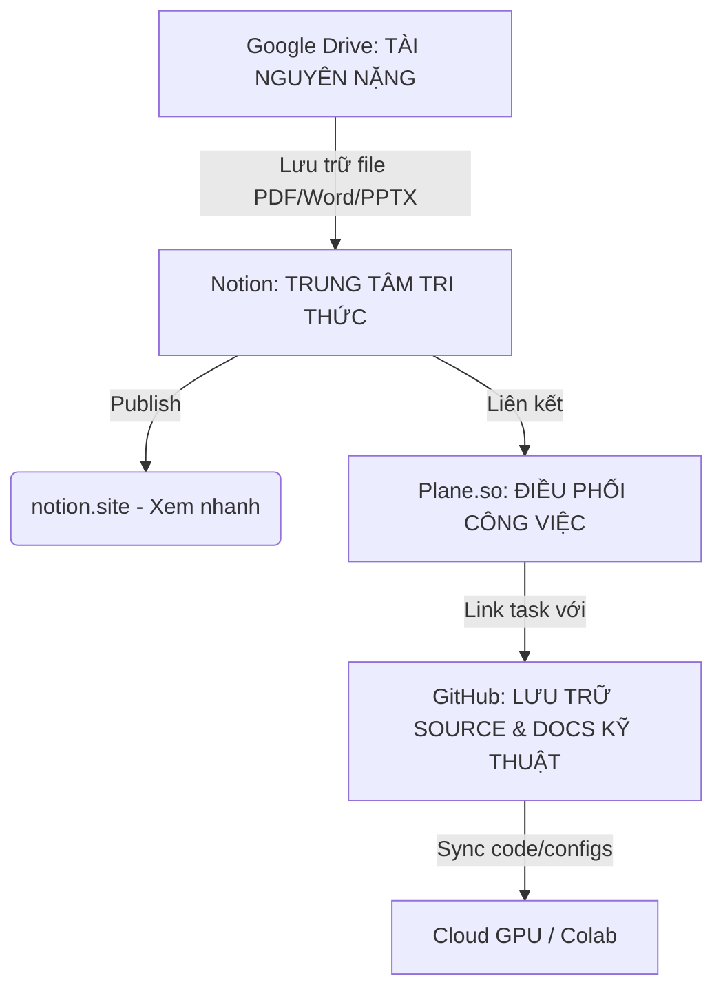

# BÁO CÁO ĐÁNH GIÁ TÀI LIỆU DỰ ÁN & ĐỀ XUẤT QUY CHUẨN WORKFLOW

Dự án: **Benchmarking TurboQuant and KV Cache Compression Methods on Vietnamese LLMs**
Môn học: **Big Data Applications: Machine Learning at Scale (DBML434077)**

---

## 1. Kết quả kiểm chứng thông tin (Grounding Search Verification)

Qua quá trình thực hiện tìm kiếm và kiểm chứng thông tin (Grounding Search) trên Google và arXiv, chúng tôi phát hiện và làm rõ một số điểm sau trong tài liệu hiện tại:

### A. Độ chính xác của các tài liệu tham khảo (References)
*   **Sai sót trong mã arXiv:** Trong file [sprint01.md](plans/sprint01.md#L55), tài liệu trích dẫn `KV-CoRE: Benchmarking Data-Dependent Low-Rank Compressibility of KV-Caches in LLMs` được ghi là `arXiv:2602.04142`. 
    *   *Thực tế kiểm chứng:* Mã `arXiv:2602.04142` thuộc về bài báo *"JSynFlow: Japanese Synthesised Flowchart Visual Question Answering Dataset built with Large Language Models"*.
    *   *Mã đúng:* Bài báo **`KV-CoRE`** có mã arXiv chính xác là **`arXiv:2602.05929`**. Cần cập nhật lại thông tin này để tránh lỗi trích dẫn học thuật trong bài báo tiếng Anh (Paper EN).
*   **Tính xác thực của TurboQuant & PolarQuant:**
    *   **TurboQuant** (`arXiv:2504.19874`): Được phát triển bởi các nhà nghiên cứu từ Google Research và NYU, công bố tại ICLR 2026. Thuật toán kết hợp phép biến đổi cực (Polar Transformation) để phân phối tọa độ đồng đều và lượng tử hóa Lloyd-Max, cùng với việc sửa sai số bằng 1-bit QJL (Quantized Johnson-Lindenstrauss).
    *   **PolarQuant** (`arXiv:2502.02617`): Được KAIST, Google Research và Yale nghiên cứu, nén KV Cache thông qua việc chuyển đổi vector sang tọa độ cực giúp loại bỏ nhu cầu lưu trữ tham số chuẩn hóa (scale và zero-points) theo block.
    *   *Tính khả thi:* Cả hai phương pháp này đều là Post-Training Quantization (PTQ) rất mới (đầu năm 2025/2026), có mã nguồn mở và đang được tích hợp/thử nghiệm trên các framework suy luận lớn.
*   **Trạng thái cập nhật (Đã hoàn thành):** 
    *   Mã arXiv của `KV-CoRE` đã được sửa đổi thành công thành `arXiv:2602.05929` trong tất cả tài liệu (`README.md`, `docs/plans/sprint01.md`, `docs/related_works.md`).
    *   Thông tin tác giả của `PolarQuant` và `TurboQuant` được cập nhật chính xác.
    *   Tệp cơ sở dữ liệu trích dẫn `paper/references.bib` đã được khởi tạo để phục vụ cho bản thảo LaTeX.
    *   Các liên kết tương đối bị hỏng trong `docs/README.md` đã được sửa và định hướng lại chính xác.

---

## 2. Kiểm tra độ hợp lý & khả thi của tài liệu dự án

### A. Điểm hợp lý (Strengths)
1.  **Mạch nghiên cứu khoa học (Storyline) chặt chẽ:** Việc định hướng kiểm thử TurboQuant trên tiếng Việt là một khoảng trống nghiên cứu (Research Gap) rất tốt. Tiếng Việt có đặc trưng token hóa phức tạp hơn tiếng Anh, do đó việc đánh giá độ suy giảm Perplexity (PPL) và hiệu năng phần cứng thực tế là đề tài có giá trị khoa học cao (đáp ứng kỳ vọng bài báo Q1 của giảng viên hướng dẫn).
2.  **Phương pháp luận (Methodology) rõ ràng:** Việc phân chia kiến trúc benchmark thành 4 tầng (Tiền xử lý, LLM Serving & Lõi nén, Giám sát đo đạc, Phân tích & Trực quan) giúp phân định rõ vai trò của từng module và đảm bảo tính độc lập khi đo đạc (không để module đo đạc gây overhead ảnh hưởng đến latency của engine chính).
3.  **Chi phí và Phần cứng khả thi:** Việc xác định đây là PTQ (Post-Training Quantization) giúp giải tỏa lo ngại về chi phí huấn luyện. Việc sử dụng Cloud GPU (RTX 4090/3090) với chi phí ~$0.20 - $0.40/giờ là cực kỳ hợp lý và nằm trong khả năng tài chính của nhóm sinh viên.

### B. Các điểm bất hợp lý & Thách thức cần khắc phục (Risks & Bottlenecks)
1.  **Sự tương thích của thư viện và phiên bản Kernel (Mid-2026):** 
    *   *Vấn đề:* TurboQuant và PolarQuant yêu cầu các nhân CUDA/Triton tùy biến để tích hợp vào vLLM. Phiên bản vLLM và CUDA trên RunPod/Vast.ai phải hoàn toàn tương thích với repo `turboquant-vllm`. Việc cài đặt bản build từ source của các kernel này rất dễ gặp lỗi xung đột compiler.
    *   *Giải pháp:* Cần yêu cầu team Kỹ thuật chạy thử nghiệm việc compile các kernel này ngay từ tuần đầu tiên trên môi trường Cloud GPU để tránh tắc nghẽn ở các tuần sau.
2.  **Nguy cơ Out-Of-Memory (OOM) ở mốc ngữ cảnh lớn (16k - 32k tokens):**
    *   *Vấn đề:* Với mô hình 7B/8B (như Llama-3.1-8B hoặc Qwen2.5-7B) chạy trên 1 GPU 24GB VRAM (như RTX 4090), khi context length tăng lên 32k, KV Cache sẽ phình to rất nhanh. Kể cả khi có nén, pha prefill cho prompt dài 32k vẫn tiêu tốn rất nhiều kích thước activation memory.
    *   *Giải pháp:* Team Tech cần cấu hình vLLM một cách phòng thủ (ví dụ: bật FlashAttention-2, giảm `max_num_seqs=1`, sử dụng `--gpu-memory-utilization 0.95` và chia block size phù hợp).
3.  **Độ dài của Báo cáo tiếng Việt (>= 30 trang):**
    *   *Vấn đề:* Đề tài benchmark thường tập trung sâu vào số liệu thực nghiệm. Để viết được $\ge 30$ trang báo cáo tiếng Việt mà không bị loãng, nhóm cần bổ sung rất nhiều hình vẽ chi tiết, giải thích sâu về toán học lượng tử hóa vector, phân tích từng case study bị lỗi ( gibberish, repetition loops) và so sánh chi tiết giữa các mô hình.

---

## 3. Đề xuất quy chuẩn Workflow quản lý tài liệu (Tránh Duplicate & Version Conflict)

Để giải quyết vấn đề duplicate tài liệu giữa 4 nền tảng (GitHub, Drive, Notion, Plane.so), nhóm nên áp dụng quy chuẩn phân quyền và phân tách vai trò như sau:

### Quy chuẩn phân vùng nội dung trên các nền tảng:

| Nền tảng | Vai trò cốt lõi | Nội dung lưu trữ | Quy tắc cập nhật & Versioning |
| :--- | :--- | :--- | :--- |
| **GitHub** | **Source Code & Technical Docs** | - Mã nguồn python, file cấu hình config, requirements. - Tài liệu hướng dẫn tái lập (`README.md` của các folder). - File `.tex` bài báo tiếng Anh. | Mọi thay đổi về code và hướng dẫn chạy phải được commit/push trực tiếp lên Git. Không lưu file Word/PPTX lên Git. |
| **Notion** | **Knowledge Base (Trung tâm Tri thức)** | - Đề cương dự án (Proposal). - Lý thuyết toán học thuật toán. - Biên bản các cuộc họp. - Hướng dẫn setup nhanh cho member mới. | Là nơi đọc chính cho cả nhóm. Khi có thay đổi về kế hoạch chung hay lý thuyết, chỉ cập nhật trên Notion, sau đó export link Notion đưa vào Plane. |
| **Plane.so** | **Project Management (Thực thi task)** | - Các thẻ task công việc theo Sprint. - Phân bổ người làm, deadline. - Mô tả checklist DoD (Definition of Done) của task. | **Tuyệt đối không viết tài liệu dài trên task Plane.** Chỉ viết checklist ngắn và đính kèm link tài liệu (Notion/Github/Drive) liên quan. |
| **Google Drive** | **Binary / Heavy Storage** | - Bản báo cáo Word cuối kỳ (`.docx`). - Slide thuyết trình (`.pptx`). - Bộ dữ liệu thô dung lượng lớn. | Sử dụng tính năng Version History của Drive/OneDrive. Mỗi tuần PM sẽ chốt 1 bản và lưu dưới dạng `Draft_v1`, `Draft_v2`. |

---

## 4. Phân biệt nội dung "Đọc" (Reading) và nội dung "Prompt"

Để nâng cao hiệu quả làm việc, đặc biệt khi ứng dụng AI (như Antigravity) hỗ trợ viết code và làm báo cáo, nhóm cần phân biệt rõ hai loại nội dung:

### A. Nội dung "ĐỌC" (Dành cho thành viên nhóm)
*   **Mục tiêu:** Giúp con người nắm bắt thông tin cực nhanh để thực thi task.
*   **Đặc điểm:** Ngắn gọn, súc tích, trực quan, sử dụng gạch đầu dòng, bảng biểu, biểu đồ.
*   **Ví dụ:** Tài liệu `datasets/dataset_brief.md` chỉ cần chỉ ra: Định dạng file JSON là gì, schema ra sao, test set gồm bao nhiêu mẫu, lưu ở đâu. Không cần giải thích lịch sử của tập dữ liệu hay các thuật toán làm sạch trong file này.

### B. Nội dung "PROMPT" (Dành cho AI/LLM Subagent)
*   **Mục tiêu:** Cung cấp đầy đủ thông tin nhất có thể để AI hiểu đúng ngữ cảnh và sinh code/văn bản chính xác 100%, không bị ảo giác (hallucination).
*   **Đặc điểm:** Đầy đủ chi tiết, có ví dụ cụ thể (Few-shot), cấu trúc biến rõ ràng, chỉ rõ đầu vào (Input), đầu ra (Expected Output), các ràng buộc (Constraints) và tài liệu API đi kèm.
*   **Ví dụ:** Khi yêu cầu AI viết script `run_baseline.py`, Prompt cần chứa:
    1.  Đoạn code import thư viện mong muốn.
    2.  Công thức toán học tính toán PPL và cách lấy logits từ vLLM.
    3.  Cấu trúc chính xác của file `results/template_log.csv` (các cột dữ liệu).
    4.  Mẫu lỗi CUDA OOM thường gặp và cách xử lý (flash attention, block size).
