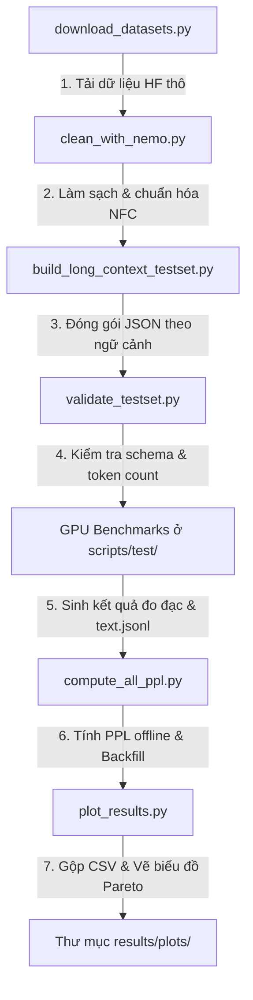

# Scripts (Thư mục Kịch bản Tự động hóa)

Thư mục này chứa toàn bộ các kịch bản lập trình Python phục vụ cho việc tự động hóa pipeline dữ liệu (tải, làm sạch bằng NeMo Curator, đóng gói test-set), các kịch bản chạy thử nghiệm đo đạc cục bộ, tính toán độ suy giảm ngôn ngữ (Perplexity) offline và trực quan hóa số liệu kết quả.

---

## 1. Sơ đồ quy trình thực hiện (Pipeline Workflow)

Mỗi kịch bản trong thư mục này đóng vai trò là một mắt xích trong quy trình benchmark khép kín:



---

## 2. Danh mục kịch bản & Metadata chi tiết

| Tên File / Thư mục | Người tạo | Vai trò / Mục đích chi tiết |
| :--- | :--- | :--- |
| **[download_datasets.py](download_datasets.py)** | Phat.Nguyen | Tự động tải dữ liệu nguồn tiếng Việt từ Hugging Face (VMLU, VTSNLP, v.v.) về định dạng JSONL thô. |
| **[clean_with_nemo.py](clean_with_nemo.py)** | Phat.Nguyen | Kịch bản tiền xử lý, chuẩn hóa NFC, loại bỏ ký tự rác và trùng lặp cấp văn bản sử dụng bộ công cụ **NVIDIA NeMo Curator**. |
| **[nemo_backend.py](nemo_backend.py)** | Phat.Nguyen | Module định tuyến cho phép khởi tạo NeMo Curator linh hoạt trên CPU (máy local) hoặc GPU (môi trường Docker). |
| **[build_long_context_testset.py](build_long_context_testset.py)** | Phat.Nguyen | Đọc dữ liệu đã làm sạch và phân bổ văn bản vào các nhóm độ dài ngữ cảnh mục tiêu (4k, 8k, 16k tokens) bằng Hugging Face Tokenizer, xuất ra file JSON. |
| **[validate_testset.py](validate_testset.py)** | Phat.Nguyen | Công cụ kiểm định tính hợp lệ của schema dữ liệu và phân phối thống kê số lượng token của các bucket ngữ cảnh. |
| **[run_baseline.py](run_baseline.py)** | Quan-min211 | Script chính thức chạy benchmark giả lập (Mock Mode) hoặc chạy đơn lẻ ở môi trường local để kiểm thử logic thu thập chỉ số. |
| **[run_mock_grid.py](run_mock_grid.py)** | Quan-min211 | Trình điều khiển Grid Search giả lập trên CPU để kiểm tra khả năng xuất file CSV log mà không cần GPU thật. |
| **[compute_all_ppl.py](compute_all_ppl.py)** | QUOC ANH \<quocanh0815@gmail.com\> | Script wrapper tự động lặp qua các dòng trong file CSV log benchmark, tải model gốc tham chiếu tương ứng và điều phối việc tính Perplexity offline. |
| **[compute_ppl_offline.py](compute_ppl_offline.py)** | QUOC ANH \<quocanh0815@gmail.com\> | Lõi tính toán Perplexity của một chuỗi sinh ra bằng Cross-Entropy Loss, đồng thời trích xuất các chỉ số kiểm tra lặp từ (`repeated_ngram_ratio`) và ký tự rác. |
| **[plot_results.py](plot_results.py)** | HuynhThach1606 | Tự động gom các file log CSV thô trong `results/` thành file tổng hợp `all_results_compiled.csv` / `all_results_summary.csv` và vẽ 4 biểu đồ phân tích đánh đổi Pareto. |
| **[utils_text.py](utils_text.py)** | Phat.Nguyen | Thư viện các hàm tiện ích dùng chung để xử lý text, chuẩn hóa chuỗi và đếm số token. |
| **[collect_expansion_data.py](collect_expansion_data.py)** | TriH28 | Script hỗ trợ thu thập và định dạng lại các nguồn dữ liệu tiếng Việt bổ sung. |
| **[create_test_set.py](create_test_set.py)** | QUOC ANH | Xây dựng cấu trúc ban đầu của bộ dữ liệu benchmark. |
| **[scrape_news_sample.py](scrape_news_sample.py)** | QUOC ANH | Scraper mẫu cào tin tức VnExpress để lấy dữ liệu thời sự nóng tiếng Việt. |
| **[test/](test/)** | Quan-min211 | **Thư mục chứa các kịch bản benchmark thực sự chạy trên server GPU vật lý** (RunPod/Vast.ai). |

---

## 3. Hướng dẫn chạy thử nhanh (Local Mock Grid)

Để đảm bảo toàn bộ pipeline ghi nhận và vẽ biểu đồ hoạt động tốt trên máy tính của bạn trước khi đưa lên máy chủ GPU:

```bash
# 1. Chạy grid giả lập để tạo file kết quả mẫu trong kết quả kết quả
python scripts/run_mock_grid.py

# 2. Chạy vẽ biểu đồ từ file dữ liệu mẫu vừa tạo
python scripts/plot_results.py
```
Các file kết quả `all_results_compiled.csv` và biểu đồ PNG sẽ xuất hiện đầy đủ trong thư mục `results/`.
